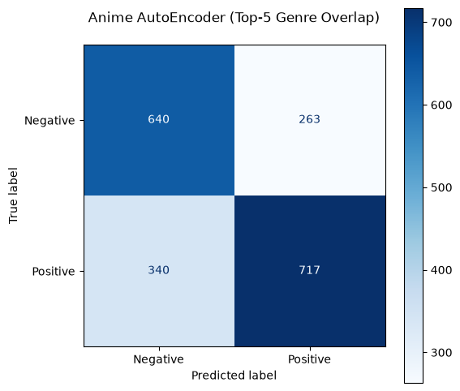
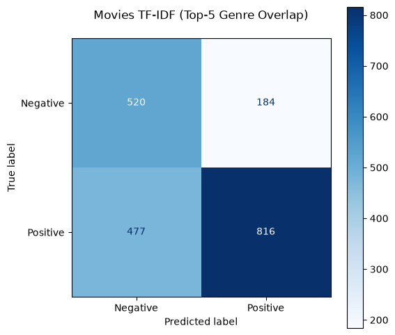
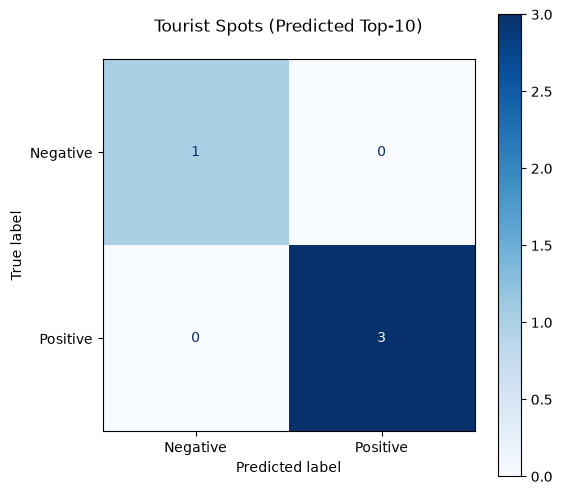

# Model Evaluation Report

## Anime
- **mse**: 0.0015
- **latent_std**: 0.0428
- **precision**: 0.7316
- **recall**: 0.6783
- **f1**: 0.7040

## Movies
- **vocab_size**: 5000
- **precision**: 0.8160
- **recall**: 0.6311
- **f1**: 0.7117

## Spotify
- **status**: Limitation
- **message**: track_embeddings.json does not store genre tags for any track (only embedding/name/artist) — genre-overlap evaluation is not obtainable from this artifact, regardless of dataset size.
## Tourist Spots
> **CAVEAT:** Directional only — sample too small for a reliable confusion matrix (n=4)

- **n**: 4
- **users**: 4
- **precision**: 1.0000
- **recall**: 1.0000
- **f1**: 1.0000

## Dining
> **CAVEAT:** no feedback data exists — precision/recall not measurable.

- **n**: 0
- **ground_truth**: none
## Myntra
- **ground_truth**: none — MyntraFeedback and MyntraEvent both empty
- **score_distribution**: {"min": null, "median": null, "max": null}
## Cross Domain
> **CAVEAT:** identical score across all evaluated users — small n, not yet confirmed as a general pattern

- **n_users_evaluated**: 4
- **convergence_distribution**: {"min": 20.0, "median": 20.0, "mean": 20.0, "max": 20.0}